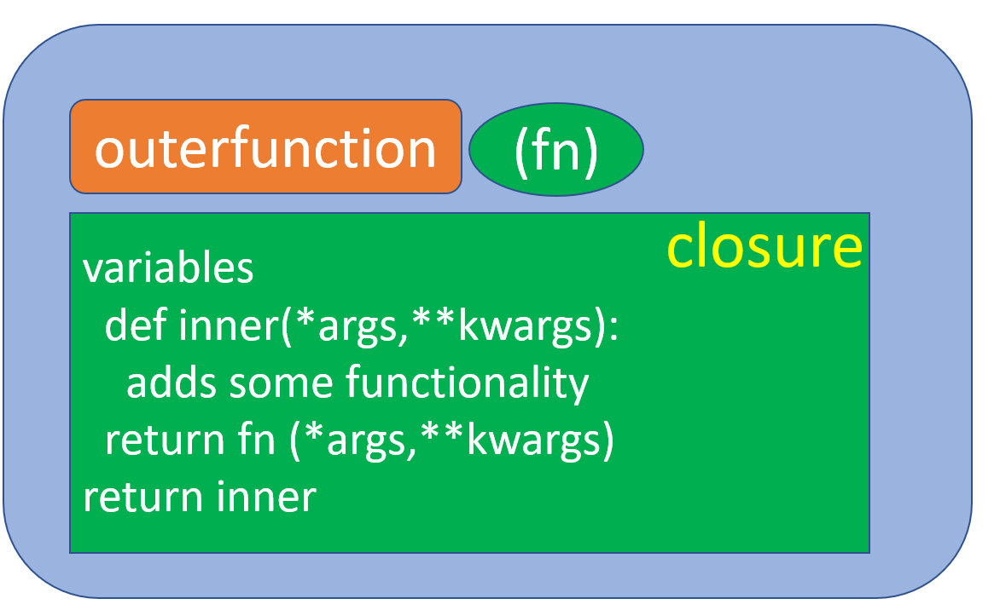

\fontsize{12}{22}
\fontseries{b}
\selectfont

```{r setup, include=FALSE}
knitr::opts_chunk$set(echo = TRUE)
if (requireNamespace("thematic")) 
  thematic::thematic_rmd(font = "auto")
library(reticulate)
reticulate::use_python("C:/Users/ADMIN/AppData/Local/Programs/Python/Python39/python.exe")
```

## <span style="color:orange"> What are decorators in Python? </span>

Decorators allow you to change the behavior of a function and, add some functionality to it without modifying the function itself. Consider a situation where we have 100 functions (or more), and we want to know when they were executed, finished, and the time elapsed in executing the functions. We may want to count the number of times a function is called. Does it need to modify all those functions?


In general a decorator function:

• takes a function as an argument

• returns a closure

• the closure usually accepts any combination of parameters

• runs some code in the inner function (closure)

• the closure function calls the original function using the arguments passed to the closure

• returns whatever is returned by that function call

{width=250px}

\newpage
### Python Code

```{python}
import time
from datetime import datetime
def summary_fn(fn):
  count=0
  def inner(*args,**kwargs):
    nonlocal count
    count+=1
    start_time = datetime.now().strftime('%Y-%m-%d %H:%M:%S')
    tmp=time.perf_counter()
    ret = fn(*args, **kwargs)
    end_time = datetime.now().strftime('%Y-%m-%d %H:%M:%S')
    total_time = time.perf_counter()-tmp
    print("function started: {}".format(fn.__name__))
    print("start_time :{}".format(start_time))
    print("end_time: {}".format(end_time))
    print("total_time: {}".format(total_time))
    print("count: {}".format(count))
    return ret
  return inner
```

\newpage
```{python}
def add(a,b):
  return a+b
add=summary_fn(add)

@summary_fn
def pw(a,b):
  return a**b

from math import sqrt
sqrt=summary_fn(sqrt)
```

\newpage
```{python}
add(1,4)
add(5,2)
add(7,10)
```

\newpage
```{python}
pw(2,3)
pw(3,2)
pw(3,3)
```

\newpage
```{python}
sqrt(4)
sqrt(169)
sqrt(16)
```


## Contact me

Contact me at masoudfaridi@modares.ac.ir or masoud1faridi@gmail.com

